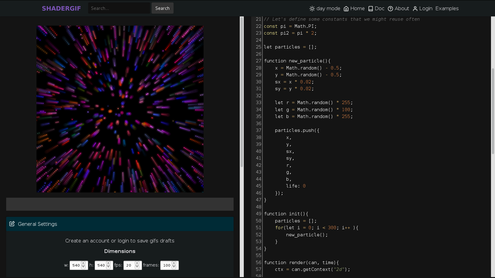

# ShaderGif

[ShaderGif](https://shadergif.com) is a GLSL editor loaded with a gif generator.

# Goals

* Avoid compiling shaders on visitor's GPU
* Be free and open source
* Make nice gifs

# Features

 * Upload textures
 * Download frames as a png zip
 * Create gifs
 * Write and receive comments
 * Gif previews - (Easy on visitor GPU, when compared to ShaderToy)

# Experimental Features

I do not test these often when releasing, so they might be broken sometimes.

 * GPU sound (experimental, be careful with your ears/speakers)
 * MathJS prototyping mode (experimental)

Write an issue or send me an email if you want to try it and it is broken.

# Licence

Shadergif is licenced under the terms of the GNU General Public License v3.0 or later. See LICENCE.txt for the full licence.

# You Want to Code ShaderGif ?

ShaderGif is coded with ruby on rails with Vue.js in the frontend.

A good first step would be to setup the docker machine or a local dev server:

Docker: look at next section.

More info on local dev servers: https://doc.shadergif.com/Development/Server/

# Running Dev Version with Docker

An alternative, instead of downloading and configuring all necessary software manually, is to use the Dockerfile.

## Additional Windows Docker Instruction

### Docker for windows (Windows 10+)

Go to docker settings (via the system tray icon), allow Docker to use the drive where you will clone the code (C:/ or D:/ or something else).

### Docker Toolbox

Normally, Virtualbox was installed along with Docker Toolbox. Go to your VirtualBox default machine settings and in the avanced network settings, share port 3000. You must add a redirection from hosts' port 3000 to the machine's port 3000, both IP addresses can be left blank. The name of the rule is not important.

If using Docker Toolbox, you should clone the git repository in a folder that is somewhere under the C:/Users/ path.

## Docker setup

If you have not cloned the repo yet:

    git clone https://github.com/antoineMoPa/shadergif.git # (You can also clone with ssh)
    cd shadergif

Then:

    docker build -t shadergif .
    docker run -p 3000:3000 -v $(pwd):/editable/shadergif -it shadergif

You can try fixing bugs, adding features, etc. If you make something cool, you can fork, push and create a pull request!

## Running ESLint

Running eslint is recommended before pull requests.

In the root shadergif folder:

    npm install
    npm run lint-fix

## Testing

In the root folder:

    rake test

# Documentation

Visit: [doc.shadergif.com](https://doc.shadergif.com)

To contribute to the documentation, install mkdocs. The text is in the `doc` folder.
