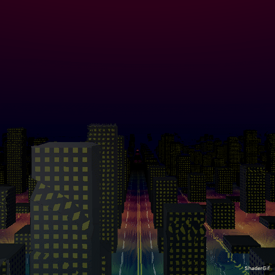
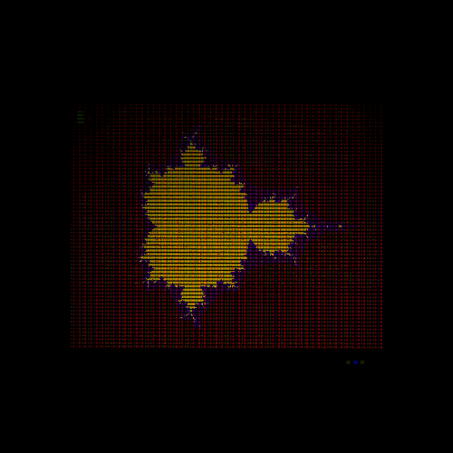

# Raymarching

This is a technique which allows the rendering of 3D scenes in a 2D fragment shader.

You can learn more about this technique on Iñigo Quilez's [site](http://www.iquilezles.org/www/articles/distfunctions/distfunctions.htm). The dude is awesome (except his [comments](http://www.iquilezles.org/blog/?p=4404) on cyclists, of course).

# Fractals

Fractals allow you to generate epic images with only some lines of math & code.

To get started with the math, you can start with Wikipedia: [Mandelbrot fractal](https://en.wikipedia.org/wiki/Mandelbrot_set).

For the mandelbrot set, you just need a `for` loop and some complex number knowledge (You will have to google things like "how to take the exponent of a complex number", no need to actually learn anything).

Pro tip: Try using a vec2 to store the complex number, myvec.x will be the real part and myvec.y will be the imaginary part.

