# Building a bridge with code

## The bridge's function

First let's start with an empty bridge function:

	precision highp float;

	varying vec2 UV;
	uniform float ratio;
	
	vec4 bridge(vec2 p){
		vec4 col = vec4(0.0);

		// We will code the bridge here

		return col;
	}
	
	
	void main(void){
	    float x = UV.x * ratio;
	    float y = UV.y;
	    
	    vec2 pos = vec2(x, y);
	    
	    vec4 col = vec4(0.0);
	
	    col += bridge(pos);
	
	    col.a = 1.0;
	    
	    gl_FragColor = col;
	}

You should now see that (nothing):

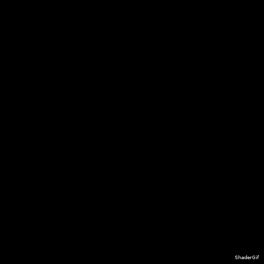

Marvelous! But let's actually add things!

In the bridge function, you can begin by plotting a line. Even easier: draw the area below a line:

	float f = 0.5;
    
    if(p.y < f){
    	col.rgb += vec3(0.2, 0.4, 0.0);
    }
	
We now have this:

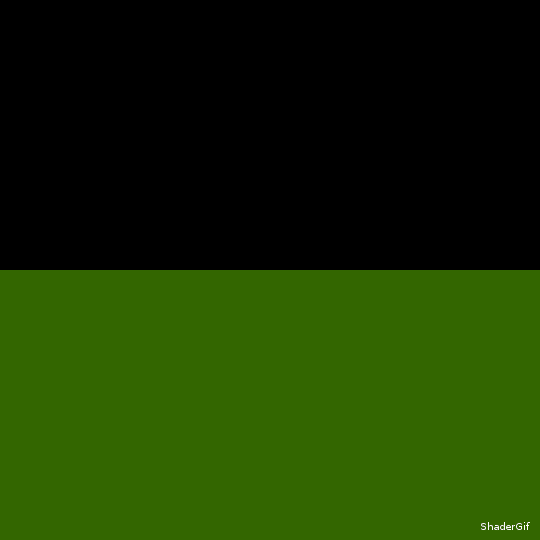

But let's say we only want to draw the line of the function.

Here we go, let's replace the function's content with:

	float f = 0.5;
    
    if(distance(p.y, f) < 0.01){
    	col.rgb += vec3(0.2, 0.4, 0.0);
    }

We could also use `abs(p.y - f) < 0.01`, you get the idea. If the point is too far away from the function, we don't draw it.

Result:

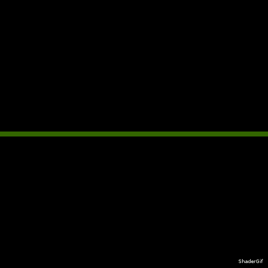

Let's say we want that line to be a curve:

	float f = 0.5 + 0.2 * cos(2.0 * p.x);

Result:

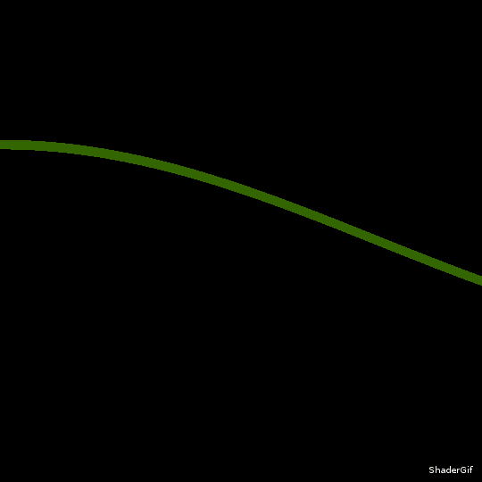

Now is the time I realize I have not centered my position at `(0,0)`. Screen UV coordinates go from 0 to 1. I prefer working with -0.5 to 0.5 and have 0,0 at the middle of the screen.

In the main, `pos` becomes:

	vec2 pos = vec2(x, y) - vec2(0.5);
	
In the bridge function, `f` becomes:

	float f = 0.0 + 0.2 * cos(2.0 * p.x);

Result:

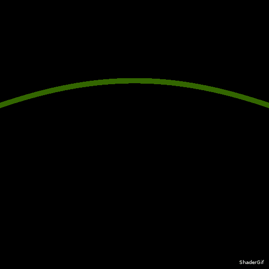

We got it! We now have a nice bridge. But let's add some detail...

## Bridge supports

In the bridge's function, we could draw many bars in the screen like that:

	if(cos(p.x * 40.0) > 0.9){
    	col.rgb += vec3(0.4, 0.4, 0.2);
    }

The `cos` function with gives cyclic values from -1 to 1 and we can use this fact to draw lines by selecting only places where the result is bigger than 0.9.

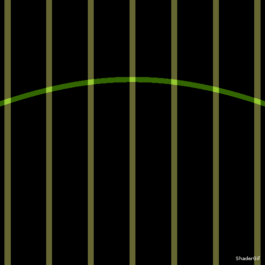

Now I want my supports to be over 0, which will be the horizon, and below `f`, the bridge. So we'll replace our previous bars solution with this:

	if(p.y < f && p.y > 0.0 && cos(p.x * 40.0) > 0.9){
		col.rgb += vec3(0.4, 0.4, 0.2);
    }
	
Which gives us:

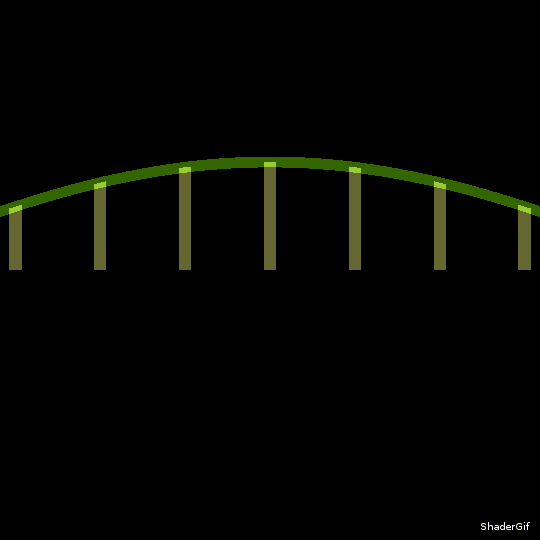

Actually, I want my supports to be taller, because I'd like to code a suspension bridge.

	if(p.y < f + 0.14 && p.y > 0.0 && cos(p.x * 40.0) > 0.9){
    	col.rgb += vec3(0.4, 0.4, 0.2);
    }

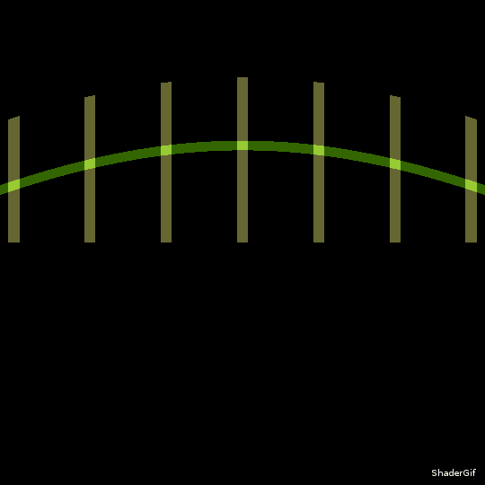

I decided to make my supports tinner and draw them only if I did not already draw the bridge's deck:

	vec4 bridge(vec2 p){
		vec4 col = vec4(0.0);
	    
	    float f = 0.0 + 0.2 * cos(2.0 * p.x);
	    
	    if(distance(p.y,f) < 0.01){
	    	col.rgb += vec3(0.2, 0.4, 0.0);
	        
	    } else if (  p.y < f + 0.14           && 
	                 p.y > 0.0                && 
	                 cos(p.x * 40.0) > 0.97       ){
	    	col.rgb += vec3(0.4, 0.4, 0.2);
	    }
	    
		return col;
	}

Result:

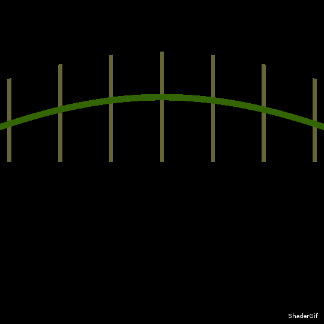

Now we could go for some cables.

## The cables

For now, I pretty much copy pasted the bridge's deck function and I replaced `f` with `cable_f`. I also put an offset of `0.14` to be at the top of the towers.

In the `bridge` function:

	float cable_f = 0.14 + 0.2 * cos(2.0 * p.x);
    
    if(distance(p.y, cable_f) < 0.01){
    	col.rgb += vec3(0.8, 0.4, 0.0);
    }

Result:

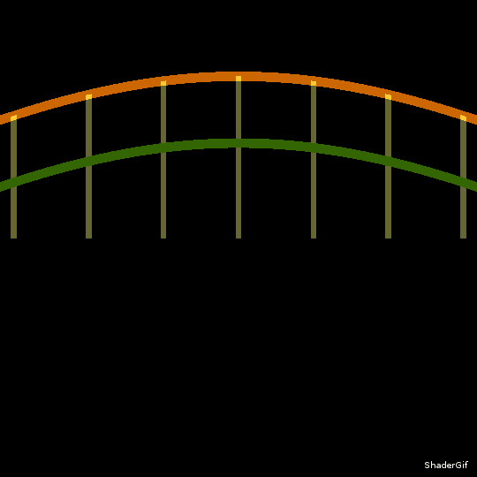

Now we want a function that is synchronised with the supports, so why not add this to `cable_f`:

	cable_f += 0.06 * cos(40.0 * p.x) - 0.06;

Honestly, to find this out, I just put a cos and tried many numbers to multiply `x` until I realised it worked perfectly when it is the same number as in the `cos` for the supports. Sometimes it is faster to randomly type on the keyboard instead of doing math. I also set both 0.06 factors by trial/error, please don't judge me.

Result:

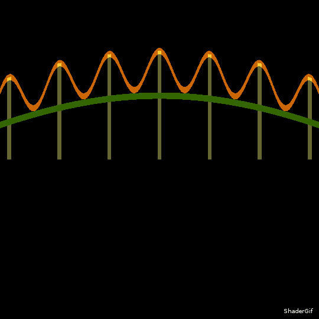

Wow, this somewhat looks like a bridge!

If you got there, this is the point where you put a paypal link on your page to get paid for your content (no).

Here is the whole code for now:

	precision highp float;
	
	varying vec2 UV;
	uniform float ratio;
	
	vec4 bridge(vec2 p){
		vec4 col = vec4(0.0);
	    
	    float f = 0.0 + 0.2 * cos(2.0 * p.x);
	    
	    if(distance(p.y,f) < 0.01){
	    	col.rgb += vec3(0.2, 0.4, 0.0);
	        
	    } else if (  p.y < f + 0.14           && 
	                 p.y > 0.0                && 
	                 cos(p.x * 40.0) > 0.97       ){
	    	col.rgb += vec3(0.4, 0.4, 0.2);
	    }
	    
	    float cable_f = 0.14 + 0.2 * cos(2.0 * p.x);
	    
	    cable_f += 0.06 * cos(40.0 * p.x) - 0.06;
	    
	    if(distance(p.y, cable_f) < 0.01){
	    	col.rgb += vec3(0.8, 0.4, 0.0);
	    }
	    
	    
		return col;
	}
	
	
	void main(void){
	    float x = UV.x * ratio;
	    float y = UV.y;
	    
	    vec2 pos = vec2(x, y) - vec2(0.5);
	    
	    vec4 col = vec4(0.0);
	
	    col += bridge(pos);
	
	    col.a = 1.0;
	    
	    gl_FragColor = col;
	}

## Suspender cables

First, a little <a href="https://wikipedia.org/wiki/refactoring" target="_blank">refactoring</a>. At this point I did some google image search for `suspension bridge parts`. I know the deck is called a deck, the cables are cables, the supports are actually called towers and the smaller cables are suspender cables. Praise the lord for the existence of the internet. 

So I renamed `f` to `deck_f` in the function `bridge`.

To build the suspenders I added this:

	if(cos(p.x * 270.0) > 0.9 && p.y > deck_f && p.y < cable_f){
    	col.rgb += vec3(0.9);
    }

As you can see, I use the same method as I used for the supports (towers). Only, the cos' factor is higher and I limit the visibility to be only between the deck and the cables.

Result:

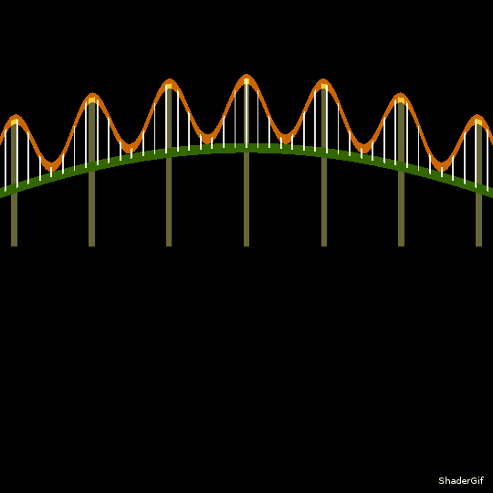

## Scene & reflection

Now, I would like to add a background. Later, I would like to reflect the entire scene to create water. To accomplish this, I will create a new function called `scene`. Instead of calling `bridge`, the main function will call `scene`, which will manage the bridge and background.

Here is `scene`:

	vec4 scene(vec2 p){
		vec4 col = vec4(0.0);
	
	    col += bridge(p);
	    
		return col;
	}

Note that `scene` has to be placed after `bridge` (because `scene` uses `bridge` and the compiler needs every function in a function to be already defined).

Don't forget to change `bridge` to `scene` in the main!

Now for the background, I will go with a sunset-ish blend of colors. This is pretty much pseudo random typing on my keyboard, with the general Idea that I use the `y` position to create a nice gradient.

Here is what I ended up with, placed just before the call to `bridge`:

	col.r += 0.6 - 0.6 * p.y;
    col.g += 0.2 - 0.3 * p.y;
    col.b += 0.3;

Result:

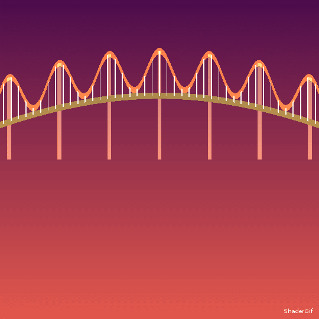
	
Then, for the water, I will at this at the end of my `main` function:

	if(pos.y < 0.0){
    	col.b += 0.2;
    }
	
Result:

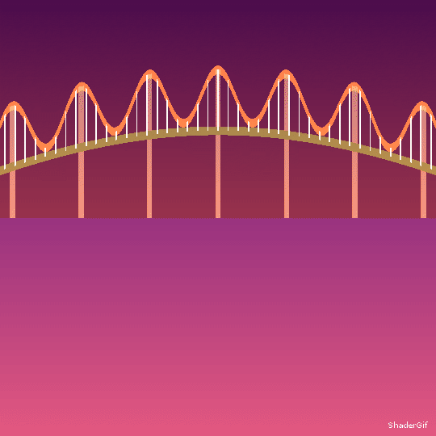

To create the reflection I simply have to call the `scene`, but with the y axis flipped. I do this by multiplying by a vector (1,-1):

In the `main`:

    col += scene(pos * vec2(1.0, -1.0));

Result:

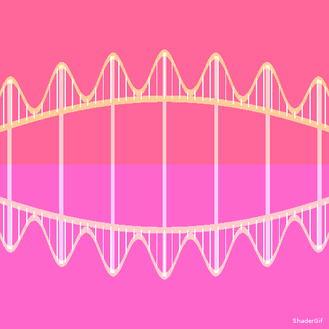

Note that the result is much too bright. This is because the background gradient is applied 2 times. A solution would be to multiply the color by `0.0` for `y < 0` in `scene`:

	if(p.y < 0.0){
    	col *= 0.0;
    }

Result:

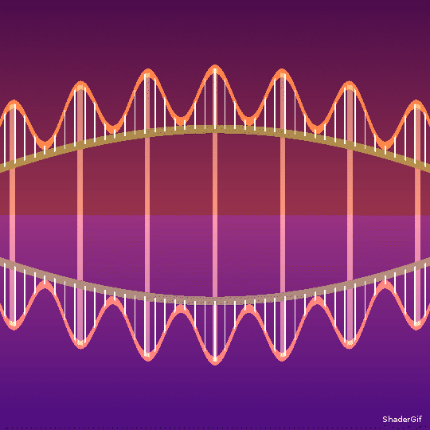

I want the reflection to be a bit transparent, so I changed my reflection line to this:

	col += 0.4 * scene(pos * vec2(1.0, -1.0));
	
Also, to add some waves, I copied `pos` to another variable, adding a sine to it.

So the previous line became:

	vec2 water_pos = pos;
    water_pos += 0.003 * cos(pos.y * 230.0);
	col += 0.4 * scene(water_pos * vec2(1.0, -1.0));

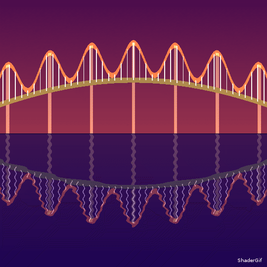

Now, I want to create an animated gif, so I will need the water to move... To do this, I must declare a uniform `time` at the top of the file, right after `uniform float ratio;`:

I now have this at the top of my file:

	precision highp float;
	
	varying vec2 UV;
	uniform float ratio;
	uniform float time;
	
	[...]

Now, I can take `time` into account in my `water_pos`. I replaced the original line with :

    water_pos += 0.003 * cos(pos.y * 230.0 + time * 6.28);

(Note: I had to reload (`CTRL`+`R`) for shadergif to manage the new uniform and actually move my water)

Result (It's alive!):

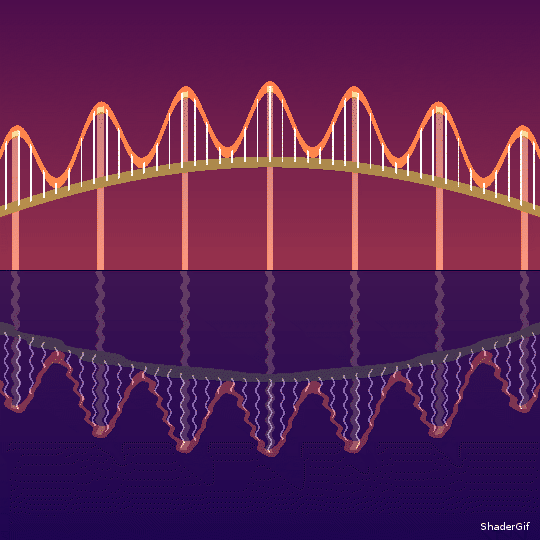

# Final artistic tweaks

I decided to change the bridge cable function to something more realistic:

	cable_f += 0.09 * (1.0 - abs(cos(20.0 * p.x + 3.1416 / 2.0))) - 0.09;

Also, I reordered the code so I only draw once in `bridge` (Note that I also changed the colors):

	vec4 bridge(vec2 p){
	    vec4 col = vec4(0.0);;
	    float deck_f = 0.0 + 0.2 * (cos(2.0 * p.x));
		
	    float cable_f = 0.14 + 0.2 * cos(2.0 * p.x);
	
	    cable_f += 0.09 * (1.0 - abs(cos(20.0 * p.x + 3.1416 / 2.0))) - 0.09;
	    
	    if(distance(p.y, deck_f) < 0.01){
	        col.rgb += vec3(0.1, 0.1, 0.2);
	    } else if (  p.y < deck_f + 0.14           && 
	                 p.y > 0.0                     && 
	                 cos(p.x * 40.0) > 0.99       ){
	        col.rgb += vec3(0.2, 0.2, 0.5);
	    } else if (distance(p.y, cable_f) < 0.004){
	        col.rgb += vec3(0.2, 0.3, 0.4);
	    } else if(cos(p.x * 490.0) > 0.9 && p.y > deck_f && p.y < cable_f){
	    	col.rgb += vec3(0.6);
	    }
	
	    return col;
	}

I also added this line in the `scene` to create a sun:

	col.rg += 1.8 * pow((1.0 - distance(p, vec2(0.0))), 18.0);
    
The development process for this line was something like:

	col.rg += distance(p, vec2(0.0))
	
Nice, I want the color to be the most intense near the center though:

	col.rg += 1.0 - distance(p, vec2(0.0))

What if I take the power:

	col.rg += pow(1.0 - distance(p, vec2(0.0)), 2)

Wow that's a nice glow, lets put a bigger exponent:

	col.rg += pow(1.0 * distance(p, vec2(0.0)), 4)

[...]

As you see, I try stuff and see if I like it. You should do the same. Find the right combination of math and human input.

The code looks like this:

	precision highp float;
	
	varying vec2 UV;
	uniform float ratio;
	uniform float time;
	
	vec4 bridge(vec2 p){
	    vec4 col = vec4(0.0);;
	    float deck_f = 0.0 + 0.2 * (cos(2.0 * p.x));
		
	    float cable_f = 0.14 + 0.2 * cos(2.0 * p.x);
	
	    cable_f += 0.09 * (1.0 - abs(cos(20.0 * p.x + 3.1416 / 2.0))) - 0.09;
	    
	    if(distance(p.y, deck_f) < 0.01){
	        col.rgb += vec3(0.1, 0.1, 0.2);
	    } else if (  p.y < deck_f + 0.14           && 
	                 p.y > 0.0                     && 
	                 cos(p.x * 40.0) > 0.99       ){
	        col.rgb += vec3(0.2, 0.2, 0.5);
	    } else if (distance(p.y, cable_f) < 0.004){
	        col.rgb += vec3(0.2, 0.3, 0.4);
	    } else if(cos(p.x * 490.0) > 0.9 && p.y > deck_f && p.y < cable_f){
	    	col.rgb += vec3(0.6);
	    }
	
	    return col;
	}
	
	vec4 scene(vec2 p){
		vec4 col = vec4(0.0);
	
	    col.r += 0.8 - 0.5 * p.y;
	    col.g += 0.2 - 0.3 * p.y;
	    col.b += 0.3;
	    
	    col += bridge(p);
	    
	    col.rg += 1.8 * pow((1.0 - distance(p, vec2(0.0))), 18.0);
	    
	    if(p.y < 0.0){
	    	col *= 0.0;
	    }
	    
		return col;
	}
	
	void main(void){
	    float x = UV.x * ratio;
	    float y = UV.y;
	
	    vec2 pos = vec2(x, y) - vec2(0.5);
	
	    vec4 col = vec4(0.0);
	
	    col += scene(pos);
	    
	    
	    vec2 water_pos = pos;
	    water_pos += 0.003 * cos(pos.y * 230.0 + time * 6.28);
	    
	    col += 0.4 * scene(water_pos * vec2(1.0, -1.0));
	    
	    if(pos.y < 0.0){
	    	col.b += 0.2;
	    }
	
	    col.a = 1.0;
	
	    gl_FragColor = col;
	}

# Final result

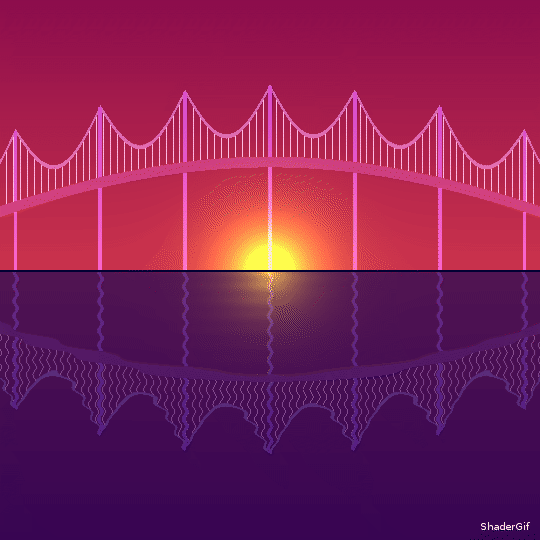
